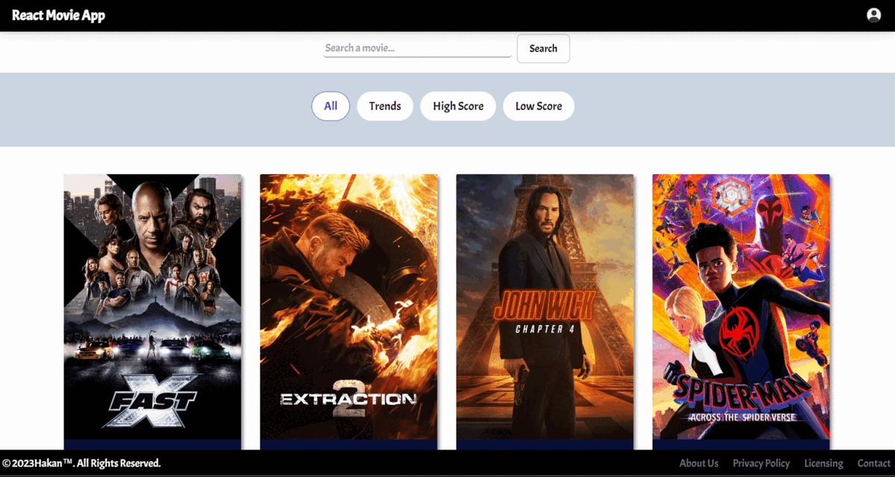

# Movie App Project

## `Gif`



## `Installation`

```
yarn create react-app (folderName OR .)
```

## `Libraries Used`


- `axios`
- `react-router-dom`
- `react-hot-toast`
- `firebase`
- `react-toastify`
- `tw-elements`


## `What am I doing`

- In this project, I am making a movie application.
- Each movie card should have summary information and rating about the movie.
- I am using Firebase for authentication operations.
- Crud operations are performed according to the swagger and redoc documents from the backend.

## Project Skeleton

```

├── public
│     └── index.html
├── src
│    ├── assets
│    │     └── myAvatar.png
│    ├── auth
|    │     └── firebase.js
│    ├── components
│    │     ├── Footer.jsx
│    |     ├── MovieCard.jsx
│    │     └── Navbar.jsx
│    ├── context
│    |     ├── AuthContext.js
│    │     └── MovieContext.js
│    ├── helpers
│    │     └── ToastNotify.js
│    ├── pages
│    │     ├── About.jsx
│    │     ├── Contact.jsx
│    │     ├── HighScore.jsx
│    │     ├── Home.jsx
│    │     ├── Licensing.jsx
│    │     ├── Login.jsx
│    │     ├── LowScore.jsx
│    │     ├── MovieDetails.jsx
│    │     ├── NotFound.jsx
│    │     ├── Policy.jsx
│    │     ├── Register.jsx
│    │     └── Trends.jsx
│    ├── router
│    │     ├── AppRouter.jsx
│    │     └── PrivateRouter.jsx
│    ├── App.js
│    ├── index.js
│    └── index.css
├── package.json
├── .gitignore
└── yarn.lock
```

## `Tools Used`

- `Redux Dev Tools` : It is a browser extension that runs on Chrome and enables tracking of all changes made to the global state. For download [click here.](https://chrome.google.com/webstore/detail/redux-devtools/lmhkpmbekcpmknklioeibfkpmmfibljd?utm_source=chrome-ntp-icon)`


## `Live`

- https://movie-app-project-theta.vercel.app/
